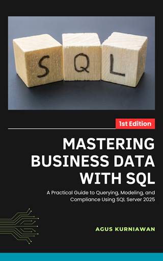

# Mastering Business Data with SQL: A Practical Guide to Querying, Modeling, and Compliance Using SQL Server 2025

*Mastering Business Data with SQL* is a comprehensive, hands-on guide for business analysts, data professionals, and technical decision-makers who want to unlock the full potential of **SQL Server 2025**. Whether you're working in analytics, compliance, or software development, this book teaches you how to **query, model, secure, and report on data** in real-world business environments.

Covering everything from the basics of `SELECT` and filtering queries to advanced **multi-tenant architecture**, **window functions**, and **GDPR compliance**, the book combines clear explanations with practical exercises using the latest SQL Server 2025 features and tools like **SSMS 21.x** and **Visual Studio Code**.

You’ll learn how to:

* Retrieve and manipulate data using core SQL skills
* Design normalized data models and enforce relational integrity
* Use **views**, **aggregates**, **joins**, and **window functions** for powerful analytics
* Architect databases for **SaaS and multi-tenant systems**
* Apply **row-level security**, **data masking**, and **encryption** for access control and privacy
* Comply with **GDPR** through techniques like pseudonymization, erasure, and audit trails
* Integrate SQL Server with **Excel** and **Power BI** for dynamic reporting

Each chapter includes structured **exercises** with step-by-step instructions and realistic datasets, making the book ideal for self-paced learning or classroom use. Whether you're preparing for enterprise projects or sharpening your SQL skills for business decision-making, this book equips you with the knowledge and tools to manage business data securely and effectively.

## Hands-on Lab Exercises

This book includes **40 hands-on lab exercises** that guide you through practical scenarios using SQL Server 2025. Each exercise builds on the previous ones, allowing you to progressively enhance your skills and apply what you've learned in real-world contexts.

* Exercise 1: Install SQL Server and Restore AdventureWorks2022  
* Exercise 2: Explore SSMS and Run Your First Query  
* Exercise 3: Select and Filter Data from AdventureWorks2022  
* Exercise 4: Filter Sales by Region and Date  
* Exercise 5: Add Calculated Columns and Handle Missing Data  
* Exercise 6: Use CASE for Business Rule Logic  
* Exercise 7: Basic ERD Design  
* Exercise 8: Design Schema for a Subscription Business  
* Exercise 9: Insert and Query Sample Data  
* Exercise 10: Apply Normalization to Improve Table Design  
* Exercise 11: Create Reusable Views for Sales Analysis  
* Exercise 12: Simplify Complex Joins via Views  
* Exercise 13: Add Tenant Column and Apply Security Filters  
* Exercise 14: Build Views and Indexes per Tenant  
* Exercise 15: Generate Monthly Revenue Summaries  
* Exercise 16: Create Pivoted Sales Report  
* Exercise 17: Filter Aggregated Results Using HAVING  
* Exercise 18: Combine Customer, Order, and Region Data  
* Exercise 19: Merge Archived and Active Records  
* Exercise 20: Rank Top Customers Monthly  
* Exercise 21: Compare Customer Revenue Month-over-Month  
* Exercise 22: Calculate Moving Averages on Sales  
* Exercise 23: Analyze Customer Sales Percentiles  
* Exercise 24: Create Analyst Role and Grant Access  
* Exercise 25: Restrict Access by Schema  
* Exercise 26: Revoke Permissions and Audit Role Membership  
* Exercise 27: Enforce Tenant Filtering with RLS  
* Exercise 28: Validate Isolation Using Test Accounts  
* Exercise 29: Audit RLS Access and Log Session Context Activity  
* Exercise 30: Mask Email and Phone Fields in Query Output  
* Exercise 31: Encrypt Sensitive Data Using Always Encrypted  
* Exercise 32: Enable and Configure an Audit Policy  
* Exercise 33: Apply DDM to PII Columns  
* Exercise 34: Apply Pseudonymization with Computed Columns or Hashes  
* Exercise 35: Implement the Right to Erasure and Portability  
* Exercise 36: Simulate GDPR “Right to Be Forgotten”  
* Exercise 37: Enable Auditing and Access Log for GDPR  
* Exercise 38: Log Consent and Data Processing Activities for GDPR Audits  
* Exercise 39: Export Sales Summary to Excel  
* Exercise 40: Connect SQL Server to Power BI Desktop for Dynamic Visualization  

## How to Buy

You can buy this book the following online stores:

* Google Play Books: https://play.google.com/store/books/details?id=ukN3EQAAQBAJ
* Lulu: https://www.lulu.com/shop/agus-kurniawan/mastering-business-data-with-sql/ebook/product-p656e69.html
* Apple iBookstore: 
* Leanpub: https://leanpub.com/bizdatasql